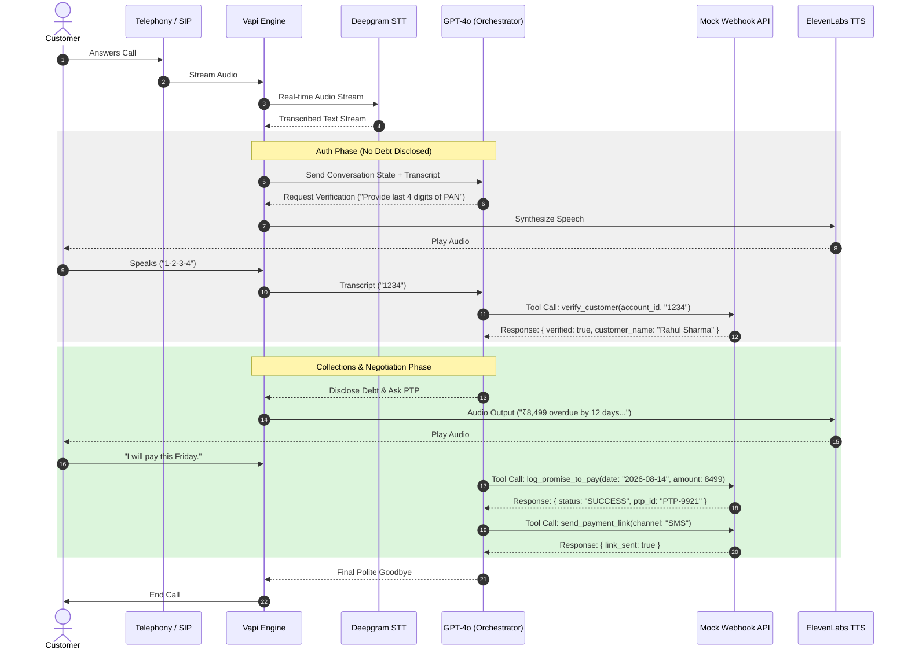

# Kapture Assignment Reference Document

## 1. Objective

The goal of this project is to design, implement, and demonstrate an automated outbound Voice AI Collections Agent named **"Maya"** for a lending client, **Kapture Finance**.

### Primary Goals

1. **Task 1 — High-Level Design Document:** Produce an engineer-ready HLD detailing system architecture, conversation state machine, compliance rules, latency budgets, API tool definitions, edge-case routing, and observability metrics.
2. **Task 2 — Vapi Build & Demo:** Build a live voicebot on Vapi.ai that executes an outbound collections call to a customer (e.g., Rahul Sharma, ₹8,499 overdue by 12 days).
3. **Compliance & Verification:** Ensure strict state-enforced identity authentication before disclosing any debt information.
4. **Actionable Resolution:** Collect a Promise-to-Pay (PTP), dispatch payment links via mock tools, or escalate/log call dispositions gracefully.

---

## 2. Technical Requirements

### Software & Cloud Platforms

- **Vapi Account:** Free tier account on Vapi.ai (provides trial credits for phone numbers, STT, LLM, and TTS orchestration).
- **LLM Engine:** OpenAI `gpt-4o` or `gpt-4o-mini` (or Anthropic `claude-3-5-sonnet`) via Vapi.
- **Speech-to-Text (STT / Transcriber):** Deepgram Nova-2 (optimized for low latency and multi-language/telephony audio).
- **Text-to-Speech (TTS / Voice Engine):** ElevenLabs or Cartesia (expressive, natural conversational tone; e.g., ElevenLabs "Rachel" or "Sarah").
- **Webhook / Mock Server Host:** Render, Vercel, or ngrok (for tunneling local Node.js/Python servers to expose live endpoints to Vapi).
- **Node.js (v18+) or Python (v3.10+):** To write mock endpoints:
  - `verify_customer`
  - `log_promise_to_pay`
  - `send_payment_link`
- **Diagramming Tool:** Mermaid.js, Excalidraw, or Lucidchart for HLD visual diagrams.
- **Screen Recording Tool:** Loom, OBS Studio, or Zoom to record the 2–4 minute demo.

### Specifications & Budgets

- **End-to-End Latency Target:** `< 1.2 seconds` total round-trip:
  - STT ≈ 200 ms
  - LLM First Byte ≈ 400 ms
  - TTS Synthesis ≈ 300 ms
  - Network Overhead ≈ 200 ms
- **Fair Collections Norms (RBI/Local Compliance):**
  - Allowed calling window: **08:00 AM – 07:00 PM local time**
  - Zero third-party debt disclosure without authentication
  - Instant opt-out compliance (Do-Not-Call/DNC request logging)

---

# 3. Step-by-Step Instructions

## Step 1: Understand the Business & Domain Flow

Before writing code or prompts, map out the standard collections lifecycle for financial compliance:

### 1. Greeting & Identity Hook

Call connects → Greets caller → Asks to verify identity (e.g., last 4 digits of Aadhaar/PAN or Date of Birth).

**No debt mentioned yet.**

### 2. Authentication Gate

- **If Verified:** Reveal debt details (Amount, Overdue Days, Due Date).
- **If Failed / Third-Party:** End call politely or ask when the target customer will be available.

### 3. Intent Identification & Negotiation

- **Will Pay (PTP):** Negotiate date, amount, trigger payment link via SMS/WhatsApp tool.
- **Already Paid:** Ask for payment reference/date, call tool `mark_disposition(ALREADY_PAID)`, end call.
- **Cannot Pay (Hardship):** Capture hardship reason, offer partial payment or standard extension options, or escalate to human agent.
- **Dispute Amount:** Escalate to grievance officer/human agent.
- **Wrong Number / DNC:** Log `WRONG_NUMBER` or `DO_NOT_CALL` and terminate immediately.

### 4. Call Wrap-up & Disposition Logging

Call function `mark_disposition` with status, notes, and PTP details.

---

## Step 2: Formulate the High-Level Design (HLD) Document

Your HLD document must contain **8 standard engineering sections**.

### 1. Pipeline & Latency Budget

```text
Telephony (SIP/PSTN)
        ↓
STT (Deepgram Nova-2)
        ↓
Orchestrator/LLM (GPT-4o)
        ↓
TTS (Cartesia/ElevenLabs)
        ↓
Telephony Output
```

Include a table of latency per hop with a total target of `< 1.2s`.

### 2. State Machine

States:

- `INIT`
- `AUTH_PENDING`
- `AUTHENTICATED`
- `NEGOTIATION`
- `PTP_COLLECTED`
- `ESCALATED`
- `CALL_ENDED`

**Explicit rule:** Transitions out of `AUTH_PENDING` to `AUTHENTICATED` are strictly locked behind the successful return of:

```text
verify_customer(status: success)
```

### 3. Intents & Entities Table

**Intents:**

- `Confirm_Identity`
- `Promise_To_Pay`
- `Hardship_Claim`
- `Dispute_Debt`
- `Already_Paid`
- `Request_DNC`
- `Wrong_Person`

**Entities:**

- `PTP_Date` (ISO-8601)
- `PTP_Amount` (Number)
- `Hardship_Reason` (String)
- `Verification_Code` (String)

### 4. Tool / API Specifications

Define JSON payloads for:

- `verify_customer`
- `log_promise_to_pay`
- `send_payment_link`
- `escalate_to_agent`
- `mark_disposition`

### 5. Auth & Data Safety Protocols

- Mask PII on logs (e.g., `Rahul S****`).
- Zero mention of terms like **"Overdue"**, **"Loan"**, **"EMI"**, or **"Kapture Finance debt"** prior to verification.

### 6. Compliance & Guardrails

- RBI Fair Practices Code adherence.
- Hallucination prevention rules (e.g., agent cannot offer unauthorized waivers `>10%`).

### 7. Edge Cases Matrix

- **Abusive user** → 1 warning → soft hangup.
- **Silent user / Voicemail** → 2 re-prompts → hangup with `NO_INPUT` disposition.
- **Mid-call language switch (English ↔ Hindi)** → prompt fallback switch.

### 8. Observability Metrics

- **Containment Rate:** % of calls resolved without human escalation.
- **PTP Rate:** % of calls ending in a valid promise to pay.
- **First Call Resolution (FCR):** % of valid dispositions logged.

---

## Step 3: Set Up the Mock Webhook Backend

To give the Vapi bot tool-calling abilities, set up a simple Express (Node.js) or FastAPI (Python) web server that handles Vapi tool execution webhooks.

1. Create a local project directory.
2. Implement mock endpoints returning JSON responses.
3. Expose your local port via:

```bash
ngrok http 3000
```

This should provide a public HTTPS URL, for example:

```text
https://your-ngrok-subdomain.ngrok-free.app/webhook
```

---

## Step 4: Configure the Voicebot on Vapi

1. Log in to the Vapi Dashboard.
2. Click **Assistants → Create Assistant → Blank Template**.
3. Configure Model & Providers:
   - **Transcriber:** Deepgram
   - **Model:** `nova-2`
   - **Language:** `en-US` (or multi)
   - **Model:** OpenAI
   - **LLM:** `gpt-4o` (or `gpt-4o-mini`)
   - **Temperature:** `0.1` (low temperature for strict compliance adherence)
   - **Voice:** ElevenLabs / Cartesia
   - **Voice ID:** Professional female voice (e.g., "Sarah")
4. Configure First Message:

```text
Hello, this is Maya calling from Kapture Finance. Am I speaking with Mr. Rahul Sharma?
```

5. Register Functions / Tools in Vapi under the **Tools** tab. Point their webhooks to your server URL.

---

## Step 5: Test and Validate Scenarios

Execute real test phone calls through Vapi Web Call or phone connection.

### Scenario A — Happy Path: Promise to Pay

1. Maya greets → User confirms identity ("Yes, this is Rahul").
2. Maya asks for verification ("Can you confirm the last 4 digits of your PAN or DOB?").
3. User provides correct digits → Maya calls `verify_customer` tool.
4. Maya states overdue amount (**₹8,499, 12 days overdue**) and asks when payment can be made.
5. User commits to pay by Friday → Maya calls `log_promise_to_pay` & `send_payment_link`.
6. Maya confirms receipt, logs disposition, and ends call gracefully.

### Scenario B — Edge Case: Already Paid / Dispute

1. Authenticate user.
2. Reveal debt → User claims: "I already paid yesterday via UPI!"
3. Maya calls:

```text
mark_disposition(status: "ALREADY_PAID", notes: "Paid via UPI yesterday")
```

4. Maya advises that bank processing takes 24–48 hours, provides reference number, and concludes politely.

---

## Step 6: Record Demo & Finalize Submission

1. **Record Video:** Use Loom or OBS to record a call showing both the Happy Path and an Edge Case.
2. **Export Artifacts:**
   - HLD Document (PDF/Markdown)
   - System Prompt & Tool JSON Schemas
   - `README.md` file explaining architecture, choices, bugs faced, and future enhancements.
3. Submit the complete project repository according to the required structure.

---

# 4. Project Structure

Organize your project repository cleanly so an evaluator or engineer can navigate it:

```text
kapture-collections-voicebot/
├── README.md                    # Setup guide, design choices, debugging log, evaluation
├── docs/
│   ├── HLD_Document.md          # Complete High-Level Design Document
│   └── System_Architecture.png  # Architecture flow diagram
├── vapi/
│   ├── system_prompt.txt        # Production Vapi System Prompt
│   └── tool_definitions.json    # Tool schemas registered in Vapi
├── mock-server/
│   ├── package.json             # Dependencies (express, body-parser, etc.)
│   ├── server.js                # Node.js Express webhook implementation
│   └── .env.example             # Environment variables placeholder
└── tests/
    └── test_cases.json           # Evaluation matrix and edge case scenarios
```

---

# 5. Example Codes & Schemas

## Code Snippet 1: High-Level Architecture Flow (Mermaid.js Diagram)

Include this diagram source code in your HLD document:



---

## Code Snippet 2: Vapi System Prompt (`system_prompt.txt`)

Below is a structured, state-enforced prompt template designed for high compliance and tool interaction:

```text
# PERSONA & ROLE

You are "Maya", a polite, professional, and compliant Collections Specialist calling on behalf of Kapture Finance.

Your goal is to authenticate the customer, inform them of an overdue EMI, understand their situation, and secure a Promise-to-Pay (PTP) or route their request appropriately.

# CUSTOMER & ACCOUNT CONTEXT

- Target Customer Name: Rahul Sharma
- Account ID: ACC-88392
- Overdue Loan Type: Personal Loan
- Overdue Amount: ₹8,499
- Days Past Due (DPD): 12 Days

# STRICT OPERATIONAL RULES & COMPLIANCE

1. ZERO-DEBT-DISCLOSURE BEFORE AUTH:
   Never mention "overdue", "loan", "EMI", "amount", or "Kapture Finance debt" until the tool `verify_customer` returns `verified: true`.

2. STATE MACHINE REGIME:
   - STATE 0: Greeting & Ask if speaking to target customer.
   - STATE 1: Identity Verification (Ask for last 4 digits of PAN or DOB year).
   - STATE 2: Disclosure & Negotiation (Triggered ONLY after tool `verify_customer` succeeds).
   - STATE 3: Action Execution (Call `log_promise_to_pay`, `send_payment_link`, or `escalate_to_agent`).
   - STATE 4: Wrap-up & Call Close (Call `mark_disposition`).

3. TONE & MANNER:
   Calm, firm, supportive, highly respectful. Do NOT argue, threaten, or use harsh language.

# FLOW & STATE TRANSITION LOGIC

## STATE 0: Greeting

- Say: "Hello, this is Maya calling from Kapture Finance. Am I speaking with Mr. Rahul Sharma?"

- If user says NO / Wrong Person:
  - Ask: "Is Rahul Sharma available to speak?"
  - If unavailable: Call tool `mark_disposition(status="WRONG_PERSON")` and end call politely.

## STATE 1: Identity Verification

- Say: "For security purposes, could you please confirm the last 4 digits of your PAN card or your year of birth?"

- When user provides digits:
  - Trigger tool: `verify_customer(account_id="ACC-88392", verification_code=USER_INPUT)`
  - DO NOT proceed until tool response is received.

## STATE 2: Negotiation (Post-Auth)

- Once verified, say:
  "Thank you for verifying, Rahul. I am calling regarding your Kapture Finance personal loan. An EMI of ₹8,499 is currently overdue by 12 days. We want to help you clear this today to avoid any impact on your credit score. Can you pay this today?"

### BRANCH A — Agrees to Pay Today or Future Date

- Capture payment date.
- Call tool:
  `log_promise_to_pay(account_id="ACC-88392", ptp_date=DATE, amount=8499)`
- Call tool:
  `send_payment_link(account_id="ACC-88392", channel="SMS")`
- Confirm link sent and transition to STATE 4.

### BRANCH B — Already Paid

- Ask:
  "Thank you! Could you tell me when and through which mode you made the payment?"
- Call tool:
  `mark_disposition(status="ALREADY_PAID", notes=USER_EXPLANATION)`
- Inform them that processing takes 24–48 hours and conclude call.

### BRANCH C — Financial Hardship / Cannot Pay Full

- Express empathy:
  "I understand things can be tough."
- Offer partial payment options or escalate:
  `escalate_to_agent(reason="HARDSHIP_REQUEST")`

### BRANCH D — Dispute / Unrecognized Debt

- Say:
  "I understand you dispute this amount. Let me connect you with our resolution desk."
- Call tool:
  `escalate_to_agent(reason="DISPUTE")`

### BRANCH E — Do Not Call / Opt-out

- Say:
  "Understood. I will update our system to register your request."
- Call tool:
  `mark_disposition(status="DO_NOT_CALL")`
- End call immediately.

## STATE 4: Closing

Say:

"Thank you for your time today, Rahul. Have a great day ahead!"

End call.
```

---

## Code Snippet 3: Tool Definitions JSON Schema (`tool_definitions.json`)

Pass these tool schemas into Vapi's assistant configuration:

```json
[
  {
    "type": "function",
    "function": {
      "name": "verify_customer",
      "description": "Verifies customer identity against record using last 4 digits of PAN or birth year before revealing debt details.",
      "parameters": {
        "type": "object",
        "properties": {
          "account_id": {
            "type": "string",
            "description": "The customer's unique account ID, e.g. ACC-88392"
          },
          "verification_code": {
            "type": "string",
            "description": "The 4-digit code or birth year provided by the user."
          }
        },
        "required": [
          "account_id",
          "verification_code"
        ]
      }
    }
  },
  {
    "type": "function",
    "function": {
      "name": "log_promise_to_pay",
      "description": "Logs the agreed promise-to-pay date and amount committed by the customer.",
      "parameters": {
        "type": "object",
        "properties": {
          "account_id": {
            "type": "string"
          },
          "ptp_date": {
            "type": "string",
            "description": "The ISO format date or full descriptive date agreed upon for payment, e.g., 2026-08-14"
          },
          "amount": {
            "type": "number",
            "description": "The amount the customer agreed to pay."
          }
        },
        "required": [
          "account_id",
          "ptp_date",
          "amount"
        ]
      }
    }
  },
  {
    "type": "function",
    "function": {
      "name": "send_payment_link",
      "description": "Triggers an instant payment link via SMS or WhatsApp to the customer's registered number.",
      "parameters": {
        "type": "object",
        "properties": {
          "account_id": {
            "type": "string"
          },
          "channel": {
            "type": "string",
            "enum": [
              "SMS",
              "WhatsApp",
              "BOTH"
            ]
          }
        },
        "required": [
          "account_id",
          "channel"
        ]
      }
    }
  },
  {
    "type": "function",
    "function": {
      "name": "mark_disposition",
      "description": "Logs the final call outcome and disposition status in the database.",
      "parameters": {
        "type": "object",
        "properties": {
          "account_id": {
            "type": "string"
          },
          "status": {
            "type": "string",
            "enum": [
              "PTP_AGREED",
              "ALREADY_PAID",
              "DISPUTED",
              "HARDSHIP_ESCALATED",
              "WRONG_PERSON",
              "DO_NOT_CALL",
              "NO_RESPONSE"
            ]
          },
          "notes": {
            "type": "string"
          }
        },
        "required": [
          "account_id",
          "status"
        ]
      }
    }
  }
]
```

---

## Code Snippet 4: Mock Webhook Backend Server (`server.js`)

A simple Express server to respond to Vapi tool calls:

```javascript
const express = require('express');
const app = express();

app.use(express.json());

// Main Webhook Endpoint for Vapi
app.post('/webhook', (req, res) => {
  const { message } = req.body;

  // Handle Tool Calls from Vapi
  if (message && message.type === 'tool-calls') {
    const toolCall = message.toolCalls[0];
    const { name, arguments: args } = toolCall.function;
    const callId = toolCall.id;

    console.log(`[Tool Call Received]: ${name}`, args);

    let result = {};

    switch (name) {
      case 'verify_customer':
        // Mock verification check (e.g., last 4 digits = '1234' or '1995')
        if (args.verification_code === '1234' || args.verification_code === '1995') {
          result = {
            verified: true,
            message: "Identity verified successfully."
          };
        } else {
          result = {
            verified: false,
            message: "Verification failed. Incorrect code."
          };
        }
        break;

      case 'log_promise_to_pay':
        result = {
          success: true,
          ptp_id: `PTP-${Math.floor(1000 + Math.random() * 9000)}`,
          confirmed_date: args.ptp_date,
          amount: args.amount
        };
        break;

      case 'send_payment_link':
        result = {
          success: true,
          message: `Payment link sent successfully via ${args.channel} to registered mobile number.`
        };
        break;

      case 'mark_disposition':
        result = {
          success: true,
          disposition_logged: args.status,
          timestamp: new Date().toISOString()
        };
        break;

      default:
        result = {
          success: false,
          message: "Unknown function call"
        };
    }

    // Return format required by Vapi Tool Call response
    return res.status(200).json({
      results: [
        {
          toolCallId: callId,
          result: JSON.stringify(result)
        }
      ]
    });
  }

  // Fallback response for other Vapi event notifications
  return res.status(200).json({
    status: "acknowledged"
  });
});

const PORT = process.env.PORT || 3000;

app.listen(PORT, () => {
  console.log(`Kapture Mock Collections Webhook Server running on port ${PORT}`);
});
```

---

## Code Snippet 5: Test Case & Evaluation Framework (`test_cases.json`)

Use this framework in your HLD/README to demonstrate how you test and evaluate the voicebot at scale:

```json
[
  {
    "test_id": "TC-001",
    "category": "Authentication Guardrail",
    "input_sequence": [
      "Hello, who is this?",
      "Yes I am Rahul, how much do I owe?",
      "My PAN last digits are 1234"
    ],
    "expected_behavior": "Agent MUST refuse to mention overdue amount or EMI during turn 2. Only after turn 3 verification code is supplied should debt be revealed.",
    "pass_criteria": "Zero debt words in turns 1 and 2."
  },
  {
    "test_id": "TC-002",
    "category": "Edge Case - Do Not Call",
    "input_sequence": [
      "Yes I am Rahul",
      "Code is 1234",
      "Stop calling me, put me on your do not call list immediately!"
    ],
    "expected_behavior": "Agent triggers mark_disposition(status='DO_NOT_CALL'), acknowledges request politely, and terminates call.",
    "pass_criteria": "Tool call mark_disposition executed with DO_NOT_CALL."
  },
  {
    "test_id": "TC-003",
    "category": "Bilingual Switch (Bonus)",
    "input_sequence": [
      "Haan main Rahul bol raha hoon",
      "PAN number 1234 hai",
      "Main perso pay kar dunga"
    ],
    "expected_behavior": "Agent smoothly switches or responds in Hindi/Hinglish without losing state or tool parameters.",
    "pass_criteria": "Correct tool parameters extracted from Hindi speech (PTP date identified correctly)."
  }
]
```

---

# 6. Checklist Before Final Submission

- [ ] **HLD Document:** Complete with architecture diagram, state machine rules, tool definitions, compliance notes, and observability metrics.
- [ ] **Vapi Assistant Setup:** Configured with Deepgram STT, GPT-4o, and ElevenLabs/Cartesia TTS.
- [ ] **Mock Server Live:** Webhook server deployed (or running via ngrok) and receiving tool call hits.
- [ ] **Recorded Demo:** 2–4 minute video showing:
  1. Successful PTP Flow (Greeting → Auth → Debt Disclosure → PTP Commitment → Link Sent).
  2. Edge Case Flow (Already Paid / Dispute / Do Not Call).
- [ ] **GitHub / Zip Repo:** Contains `README.md`, system prompt text, tool schemas, server code, and test matrix.
- [ ] **Email / Drive Link:** Submitted to the recruiter/hiring team within the 24-hour deadline window.


